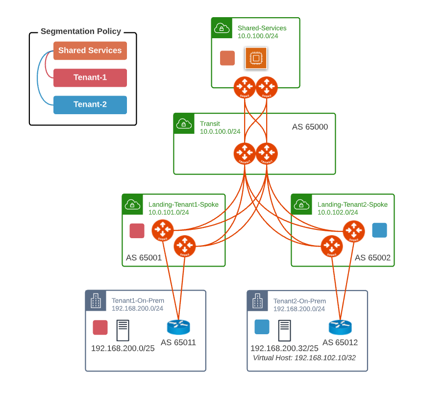
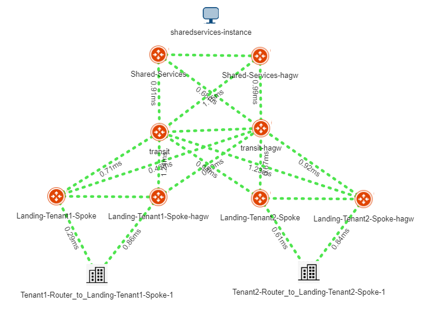
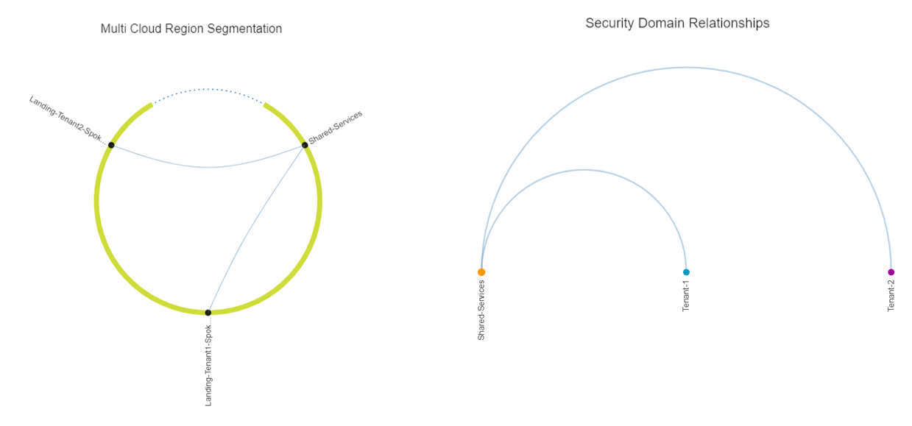

# Aviatrix BGP on Spoke NAT  Demo

This repository provides a Terraform implementation that demonstrate BGP on Spoke with NAT on AWS.

The code provided is for demo purposes only.







## Prerequisites

Please make sure you have:
- Aviatrix Controller 6.6
- AWS access accounts are onboarded. 

## Environment Variables

To run this project, you will need to set the following environment variables

Variables | Description
--- | ---
AVIATRIX_CONTROLLER_IP | Aviatrix Controller IP or FQDN 
AVIATRIX_USERNAME | Aviatrix Controller Username
AVIATRIX_PASSWORD | Aviatrix Controller Password
TF_VAR_aws_account | AWS Aviatrix Account 

## Run Locally

Clone the project

```bash
git clone https://github.com/bayupw/avx-bgp-on-spoke-nat-demo
```

Go to the project directory

```bash
cd avx-bgp-on-spoke-nat-demo
```

Set environment variables

```bash
export AVIATRIX_CONTROLLER_IP="aviatrixcontroller.aviatrix.lab"
export AVIATRIX_USERNAME="admin"
export AVIATRIX_PASSWORD="aviatrix123"
export TF_VAR_aws_account="AWS-Aviatrix-Account"
```

Optional environment variables

```bash
export TF_VAR_key_name="my_keypair"
```

Terraform workflow

```bash
terraform init
terraform plan
terraform apply -auto-approve
```

## Inputs

| Name | Description | Default | Required |
|------|-------------|---------|----------|
| cloud_supernet | CIDR for the overall AWS supernet | `10.0.0.0/8` | no |
| tenant_cidr | CIDR for the tenant | `192.168.200.0/24` | no |
| tenant_2_virtual_host | /32 Virtual Host for the tenant-2 | `192.168.102.10/32` | no |
| aws_account | AWS Account for Aviatrix Controller | `null` | yes |
| aws_region | AWS Region | `ap-southeast-2` | no |
| aws_instance_size | AWS gateway instance size | `t2.micro` | no |
| hpe | Insane mode flag | `false` | no |
| ha_gw | Enable HA gateway | `true` | no |
| enable_segmentation | Enable segmentation | `true` | no |